<div align="center">



<br><br>

<a href="https://www.linkedin.com/in/nomaan-munshi">
  
</a>
<a href="mailto:nomaanmunshii@gmail.com">
  
</a>

</div>

---

## 👋 About Me

I am an Information and Communications Engineering student at the **University of Trento, Italy**, focused on backend and full-stack development with **Java and Spring Boot**.

I enjoy understanding how real software systems are designed, secured, tested and deployed. My current interests include backend engineering, Spring Security, REST APIs, PKI/TLS, automation and software architecture.

- 📍 Based in Trento, Italy
- 🎓 Studying Information and Communications Engineering
- ☕ Building with Java, Spring Boot, MySQL and Docker
- 🔐 Learning more about PKI, TLS and backend security
- 💼 Open to software engineering and security-focused internships
- 🥾 Outside coding: hiking, travelling and turning unusual ideas into projects

---
### 🤖 AI-Assisted Development

I use AI-assisted development tools to accelerate research, prototyping, debugging, testing and documentation. I review and validate the generated output, adapt it to the project’s architecture and make sure I understand the final implementation.


## 🛠️ Tech Stack

### Backend and Security

<p>
  
  
  
  
  
</p>

### Databases and Infrastructure

<p>
  
  
  
  
  
</p>

### Frontend and Development Tools

<p>
  
  
  
  
  
  
</p>

---

## 🚀 Featured Projects

### 🏥 Synapse HEA — Hospital Management System

A production-minded healthcare management platform built with **Java 21, Spring Boot, React, TypeScript, MySQL, Redis, Docker and Nginx**.

Key areas:

- Authentication and role-based access
- Spring Security and JWT
- Appointment management
- Medical records and prescriptions
- Billing and invoice generation
- REST APIs and API documentation
- Redis caching and live notifications
- Docker-based deployment
- GitHub Actions continuous integration

[View repository →](https://github.com/nomannn13/synapse-hea-healthcare-system)

---

### 🏎️ Krotoski Łódź Digital Twin

A digital-twin project created for showroom operations using **React, TypeScript and modern web technologies**.

The project explores how digital interfaces and data-driven systems can represent and improve real-world business processes.

[View repository →](https://github.com/nomannn13/tac-krotoski-lodz-digital-twin)

---

## 🎯 Current Focus

```java
public class CurrentFocus {

    private final String[] learning = {
        "Advanced Java",
        "Spring Boot",
        "Spring Security",
        "PKI and TLS",
        "Backend Automation",
        "Software Architecture"
    };

    public void keepBuilding() {
        System.out.println("Learn. Build. Break. Fix. Repeat.");
    }
}
```

---

## 🎓 Education

**Bachelor of Science in COMPUTER,Communication & Electronics Engineering**  
University of Trento, Italy

Relevant areas include programming, computer architecture, databases, networking, operating systems, software engineering, probability, electronics and signal processing.

---

<div align="center">

### 🤝 Connect With Me

<a href="https://www.linkedin.com/in/nomaan-munshi">
  
</a>
<a href="mailto:nomaanmunshii@gmail.com">
  
</a>

<br><br>

<i>Building useful systems, exploring new places and occasionally having crazy project ideas.</i>

</div>
