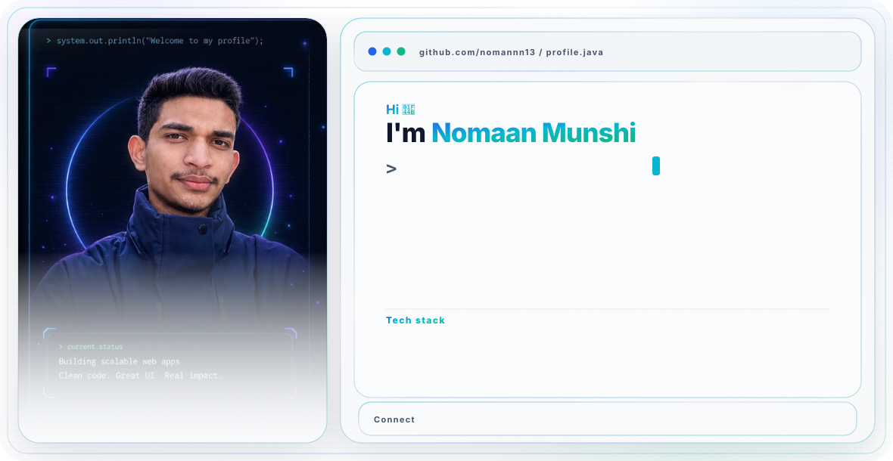

 

  

<strong>Information and Communications Engineering Student @ University of Trento</strong>

Backend Engineering • Java • Spring Boot • Security • PKI/TLS

About Me

I am an Information and Communications Engineering student at the University of Trento, Italy, focused on backend and full-stack development with Java and Spring Boot.

I enjoy understanding how real software systems are designed, secured, tested and deployed. My current interests include backend engineering, Spring Security, REST APIs, PKI/TLS, automation and software architecture.

📍 Based in Trento, Italy

🎓 Studying Information and Communications Engineering

☕ Building with Java, Spring Boot, MySQL and Docker

🔐 Learning PKI, TLS and backend security

💼 Open to software engineering, backend and security-focused internships

🥾 Outside coding: hiking, travelling and turning unusual ideas into projects

Tech Stack

Backend & Security

  
  
  
  
  

Databases & Infrastructure

  
  
  
  
  

Frontend & Development Tools

  
  
  
  
  
  

Featured Projects

Synapse HEA — Hospital Management System

A production-minded healthcare management platform built with Java 21, Spring Boot, React, TypeScript, MySQL, Redis, Docker and Nginx.

Key areas

Authentication and role-based access

Spring Security and JWT

Appointment management

Medical records and prescriptions

Billing and invoice generation

REST APIs and API documentation

Redis caching and live notifications

Docker-based deployment

GitHub Actions continuous integration

View repository →

Krotoski Łódź Digital Twin

A digital-twin project created for showroom operations using React, TypeScript and modern web technologies.

The project explores how digital interfaces and data-driven systems can represent and improve real-world business processes.

Highlights

Interactive frontend experience

Modern React and TypeScript workflow

Business-process-oriented system design

Real-world digital representation concepts

View repository →

Current Focus

I am currently strengthening the areas most relevant to backend and security engineering:

Advanced Java

Spring Boot

Spring Security

PKI and TLS

Backend automation

Software architecture

public final class CurrentFocus {

    private final String[] learning = {
        "Advanced Java",
        "Spring Boot",
        "Spring Security",
        "PKI and TLS",
        "Backend Automation",
        "Software Architecture"
    };

    public void keepBuilding() {
        System.out.println("Learn. Build. Break. Fix. Repeat.");
    }
}

AI-Assisted Development

I use AI-assisted development tools to accelerate research, prototyping, debugging, testing and documentation.

I review and validate generated output, adapt it to the project architecture and make sure I understand the final implementation. AI supports the workflow, while responsibility for engineering decisions and code quality remains with me.

Education

University of Trento — Trento, Italy

Bachelor's Degree in Information and Communications Engineering

Relevant areas include programming, software engineering, databases, computer networks, operating systems, computer architecture, probability, electronics, signal processing, physics and calculus.

Connect With Me

  

<i>Building useful systems, learning deeply and turning ambitious ideas into working software.</i>

